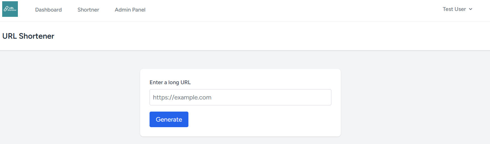
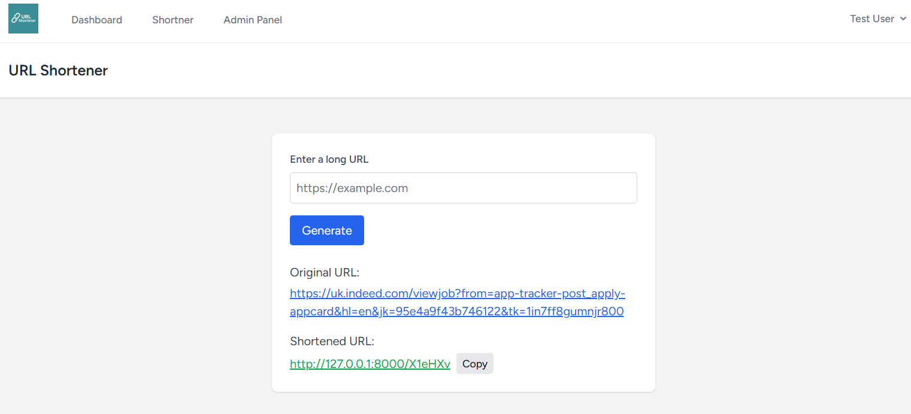
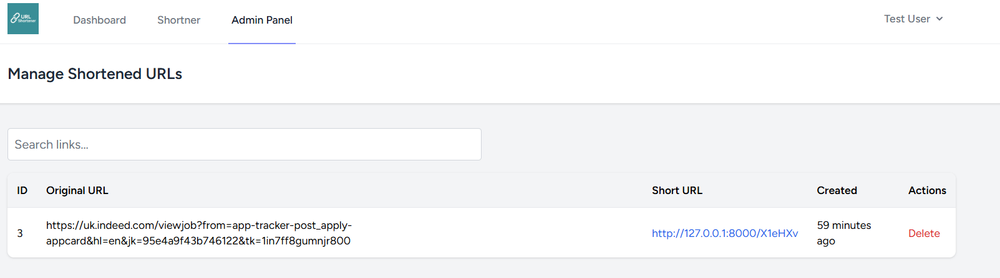

# 🔗 Laravel URL Shortener

A simple and clean Laravel 11-based URL shortening service with API and web UI.

---

## 🚀 Features

- Encode long URLs into short links
- Decode short URLs back to original
- Web UI with copy-to-clipboard
- Admin panel to manage links
- Test user seeder
- Protected with Laravel Breeze (auth)

---

## 📦 Installation

```bash
git clone https://github.com/your-username/url-shortener.git
cd url-shortener

composer install
cp .env.example .env
php artisan key:generate
php artisan migrate
php artisan db:seed # Adds test user
npm install && npm run dev
php artisan serve
----------------------------------------------------------------------------------------------------------

👤 Test User
You can log in with:

Email: test@example.com
Password: password
----------------------------------------------------------------------------------------------------------

📘 API Usage

➕ POST /api/encode

    Body:
    {
    "url": "https://example.com"
    }
    Response:
    {
    "short_url": "http://localhost:8000/abc123"
    }

🔄 POST /api/decode

    Body:
    {
    "short_url": "http://localhost:8000/abc123"
    }
    Response:
    {
    "original_url": "https://example.com"
    }
----------------------------------------------------------------------------------------------------------
🖥️ Web UI

  Visit /shorten to use the web form

  Copy short links easily

  Admin Panel at /admin/links (auth required)
----------------------------------------------------------------------------------------------------------
🧪 Running Tests

php artisan test
----------------------------------------------------------------------------------------------------------
🛠 Tech Stack

 Laravel 11/12
 Laravel Breeze (Blade + Tailwind)
 Vite
 MySQL / SQLite (dev)


 
  
   


 Thank you !